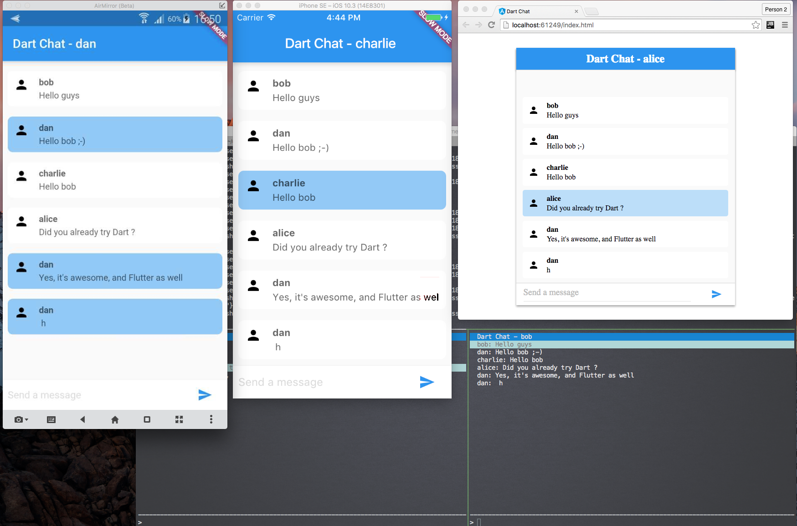

# Meetup - Live Coding - Full Stack Chat Application with Dart, Angular & Flutter

## Background

Alice, Bob, Charlie and Dan are 4 techies friends that would like to chat with a standalone Full Stack Chat Application using Dart, Angular and Flutter.

Alice prefers to use Web application for chatting.

Bob likes Command Line application.

Charlie and Dan regulalry use Android and iOS bases smartphones.

## Steps

* [Pre-requisites](doc/dart_chat-100.md) ([Code](steps/dart_chat-100))
* [Shared Data Model & Common configuration](doc/dart_chat-200.md) ([Code](steps/dart_chat-200))
* [Server](doc/dart_chat-201.md) ([Code](steps/dart_chat-201))
* [Websocket](doc/dart_chat-202.md) ([Code](steps/dart_chat-202))
* [CLI Client](doc/dart_chat-300.md) ([Code](steps/dart_chat-300))
* [Angular Client](doc/dart_chat-301.md) ([Code](steps/dart_chat-301))
* [Android/iOS Clients with Flutter](doc/dart_chat-302.md) ([Code](steps/dart_chat-302))
